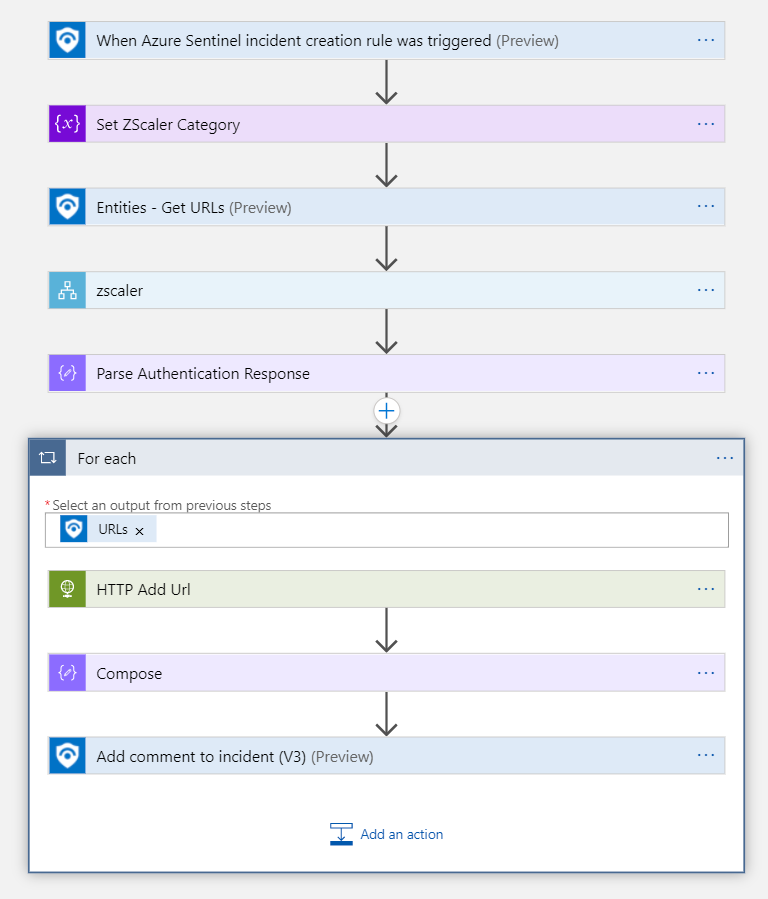

# ZScaler - Add URL to category

 
## Table of Contents

1. [Summary](#overview)
1. [Prerequisites](prerequisites)
1. [Deployment](#deployment)
1. [postdeployment](postdeployment)
1. [Authentication](#Authentication)
1. [References](#references)

## Summary

This folder contains 1 playbook: 
* Add IP to category: Add one or more URLs to an existing ZScaler category

The playbook is used to respond to an incident in Azure Sentinel and uses the Zscaler API. The playbook leverages the [authentication playbook](../authentication/readme.md).  The results of the scan are snown in the related Azure Sentinel Incident. 

## Prerequisites

1. Playbook templates leverage the ZScaler API. To use the Zscaler capabilities, you nees a Zscaler API key. Refer this link: [API Developers Guide: Getting Started](https://help.zscaler.com/zia/api-getting-started)

## Deployment instructions 

You can choose to deploy one ore more playbooks.

1. Deploy a playbook by clicking on "Deploy to Azure" button. This will take you to deplyoing an ARM Template wizard.
2. Fill in the required parameters:
    * Resource group
    * Region
    * Playbook name
    * Storage account name (newly created storage account, which is used by the playbook)
    * ZScaler Admin Url
    * ZScaler Key
    * ZScaler Username
    * ZScaler Password
    * Category (Name of an existing ZScaler category)

### Add IP to category:

## Post-Deployment instructions 
### a. Authorize connections
Once the deployment is completed, you will need to authorize each connection. There are connection for Azure KeyVault and Azure Sentinel. For each connection complete the following steps:
 1. Click edit API connection
 1. Fill in the necessary information
 1. Click Authorize
 1. Sign in
 1. Click Save

### b. Configurations in Azure Sentinel
For Azure Sentinel some additional configuration is needed:
1. Enable Azure Sentinel Analytics rules that create alerts and incidents which includes the relevant entities.
1. Configure automation rule(s) to trigger the playbooks.

## Learn more
* <a href="https://help.zscaler.com/zia/api" target="_blank">Zscaler API</a>